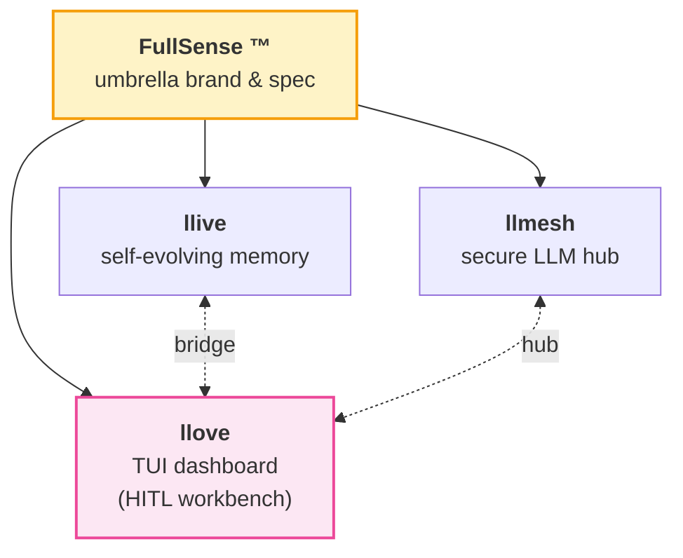
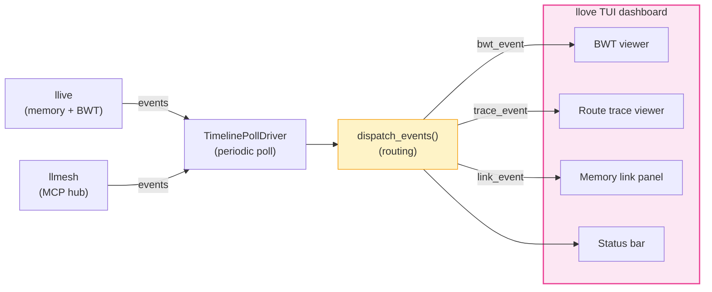

# FullSense ™ — llove

> **このページについて(やさしい説明)**: llove は、端末(ターミナル)の中で動く画面表示ツールです。センサーや LLM(大規模言語モデル)から流れてくる情報を、表やグラフのように見やすく並べて表示し、人が見ながら判断・操作できる作業台の役割を果たします。本ページは llove に関する各ドキュメントへの入り口(目次)です。専門用語の意味は [用語集(GLOSSARY.md)](GLOSSARY.md) を参照してください。

> **Part of the [FullSense ™](https://github.com/furuse-kazufumi/llive/blob/main/TRADEMARK.md) family** — `llmesh` ・ `llive` ・ **llove** の 3 製品で構成される FullSense ブランドの中で、本サイトは **llove (TUI(Text User Interface、テキストユーザーインターフェース) ダッシュボード(dashboard) / 人間参加型(Human-in-the-Loop, HITL) ワークベンチ(workbench))** の公式 ドキュメント(documentation) です。

---

## FullSense Family



| Product   | Role                                       | Site                                                |
|-----------|--------------------------------------------|-----------------------------------------------------|
| **llmesh** | secure LLM hub / on-prem MCP server        | <https://furuse-kazufumi.github.io/llmesh/>         |
| **llive**  | self-evolving modular memory LLM framework | <https://furuse-kazufumi.github.io/llive/>          |
| **llove**  | TUI dashboard / HITL workbench             | this site                                          |

## Architecture — F25 Bridge (llove ↔ llmesh ↔ llive)

llove は F25 連携基盤を通じて llmesh の MCP hub と llive の memory bus を 1 つの TUI dashboard に統合する。BWT (Bayesian Work Tree) / route trace / memory link を 3 つの viewer に分割表示。



## Quick Start

```bash
pip install llmesh-llove
```

詳細は [README.md](https://github.com/furuse-kazufumi/llove#readme) を参照。

## Documentation

| Topic                       | File                                                  |
|-----------------------------|-------------------------------------------------------|
| F25 tutorial                | [F25_TUTORIAL.md](F25_TUTORIAL.md)                    |
| Progress log                | [PROGRESS.md](PROGRESS.md)                            |
| Contributing scenarios      | [contributing-scenarios.md](contributing-scenarios.md)|
| i18n                        | [i18n.md](i18n.md)                                    |
| llove ↔ llive bridge        | [llove_llive_bridge.md](llove_llive_bridge.md)        |
| LinkedIn 概観 (ja/en/zh)    | [linkedin/](linkedin/)                                |
| Qiita 概観                  | [qiita/](qiita/)                                      |

## Links

- **GitHub**: <https://github.com/furuse-kazufumi/llove>
- **PyPI**: <https://pypi.org/project/llmesh-llove/>
- **Contact**: `kazufumi@furuse.work`

---

*FullSense ™ / llove ™ are trademarks of Kazufumi Furuse.*
