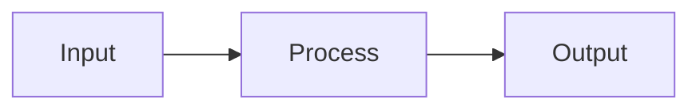

# Qiita Authoring Guide

llove / llive / llmesh の Qiita 投稿に **画像 / Mermaid / アニメ画像** を入れる
ための実用ガイド。記事更新時にコピペで使える形でまとめる。

## Qiita の表示能力

| 形式                    | 対応 | 備考                                          |
|-------------------------|:----:|-----------------------------------------------|
| 画像 (PNG / JPG / GIF)  | ✓    | Qiita ホストか外部 URL (GitHub Raw も OK)     |
| 静的 SVG                | ✓    | `` タグ経由、または ``               |
| **Animated SVG (CSS)**  | ✓    | GIF より高品質、ベクター、Qiita で再生される   |
| Mermaid 図              | ✓    | `mermaid` 言語タグ付き code block で render   |
| Animated GIF            | ✓    | 容量大、シーケンスが短い場合に有用             |
| mp4 / webm              | △    | `<video>` タグで可だが Qiita 標準 UI で不安定  |
| asciinema               | ✗ (直接埋込み不可) | リンクのみ、`<a>` タグで誘導          |

## 画像 URL の出し方

### GitHub Raw (推奨、低レイテンシ)

```
https://raw.githubusercontent.com/furuse-kazufumi/<repo>/main/docs/scenarios/svg/<name>.svg
```

例:

```markdown

```

### GitHub Pages 経由 (キャッシュ + CDN)

```
https://furuse-kazufumi.github.io/<repo>/scenarios/svg/<name>.svg
```

ただし Pages ビルドが終わってからでないと返らない (build pending 中は 404)。

### Qiita 内ホスト

エディタの画像挿入 UI でアップロード → `https://qiita-image-store.s3.amazonaws.com/...` の URL。記事の永続性が高い (リポジトリ削除と独立) が、画像更新には記事側を編集し直す必要あり。

**推奨**: 「最新を反映したい」なら GitHub Raw、「記事 freeze したい」なら Qiita 内ホスト。

## Mermaid 図の埋込み (Qiita 標準サポート)

```markdown

```

Qiita エディタは 2022 年以降 Mermaid を自動 render する。GitHub Pages の just-the-docs theme も同様。**同一の Mermaid ソースが両方で使える**ので、`docs/` 配下の Mermaid 図を Qiita 記事にコピペで OK。

代表的な使い方:

- `flowchart` — アーキテクチャ図、データフロー
- `sequenceDiagram` — API 呼び出し順序
- `stateDiagram-v2` — state machine
- `erDiagram` — DB スキーマ
- `gantt` — ロードマップ
- `journey` — UX

## SVG スクリーンショットの生成

各 demo scenario の TUI を SVG で保存する。**Textual の `App.save_screenshot()`** が text 形式の SVG を出すので、git diff 可能 + Pages 軽量配信。

```bash
# 単一 scenario
py -3.11 scripts/export_demo_svgs.py --scenario=firewall

# 全 scenario (17 件)
py -3.11 scripts/export_demo_svgs.py
```

出力: `docs/scenarios/svg/<scenario>.svg`

Qiita への貼付け例:

```markdown

```

## Animated SVG の生成 (動きがある scenario 向け)

shogi / mindmap / RAG など時間軸を持つ scenario は **animated SVG** が映える。複数フレームを 1 つの SVG に CSS keyframes で結合する。

```bash
# 将棋アニメ (8 フレーム × 1.5s = 12 秒ループ)
py -3.11 scripts/export_demo_anim_svg.py --scenario=shogi --frames=8 --frame-delay=1.5

# RAG (回答生成の流れ)
py -3.11 scripts/export_demo_anim_svg.py --scenario=rag --frames=6 --frame-delay=2.0

# mindmap (ノード追加)
py -3.11 scripts/export_demo_anim_svg.py --scenario=mindmap --frames=10 --frame-delay=1.0
```

出力: `docs/scenarios/anim/<scenario>.svg` (典型 ~500 KB / 8 フレーム)

Qiita 貼付け:

```markdown

```

**注**: Qiita では `` の Markdown 画像構文より、`` タグの方が
アニメ SVG が確実に動く。

## チューニング

| やりたいこと                  | フラグ                          |
|-------------------------------|----------------------------------|
| 1 フレームを長く見せる        | `--frame-delay=3.0`             |
| フレーム数を増やす (動きを密に) | `--frames=12`                  |
| 横長表示にする                | `--size=160x40`                  |
| 縦長表示にする                | `--size=100x50`                  |

容量が大きすぎる (>1 MB) 場合:

- `--size=100x24` に下げる (size に比例)
- `--frames=4` に減らす (frames に比例)
- 必要なら手動で SVG 内の冗長な font-face 定義を削る (Textual SVG は font をフレームごとに inline するため重複部分が多い)

## Qiita 記事更新の典型ワークフロー

1. ローカルで scenario を実行し、`docs/scenarios/svg/` または `docs/scenarios/anim/` を更新
2. `git add docs/scenarios/ && git commit && git push`
3. 数分待って GitHub Pages 反映を確認 (`https://furuse-kazufumi.github.io/<repo>/`)
4. Qiita 記事を編集、`docs/qiita/qiita-overview.md` (リポ内マスタ) を更新
5. リポ内マスタの内容を Qiita エディタにコピペ → 公開
6. Qiita 投稿の冒頭に「※ 本記事の最新版は <GitHub link> に同期」とリンクを残す

## アニメ画像のオフライン代替 (GIF)

Qiita 環境で animated SVG が動かないケースに備え、GIF 版を併設する場合:

```bash
# 要 ImageMagick + pdf2cairo or rsvg-convert (Windows では別途インストール)
# 1. アニメ SVG をフレーム PNG 列に分解
# 2. ImageMagick で GIF 化:
magick -delay 150 -loop 0 frame_*.png shogi.gif
```

代替: animated SVG をブラウザで開き、ブラウザ拡張で GIF 化 (e.g. "SVG to GIF" 拡張)。**普段はアニメ SVG だけで十分**で、GIF 併設はオプション扱い。

## 関連

- `scripts/export_demo_svgs.py` — 静的 SVG (1 frame)
- `scripts/export_demo_anim_svg.py` — animated SVG (N frame)
- `docs/scenarios/index.md` — gallery (GitHub Pages 経由)
- `docs/qiita/qiita-overview.md` — Qiita 投稿マスタ
