# Demo Scenarios — SVG Gallery

llove は TUI dashboard としての見え方を、各シナリオに **SVG スクリーンショット**
として `docs/scenarios/svg/` に commit していく方針。

各 SVG は Textual の `App.save_screenshot()` で出力される **ベクター形式**
(ターミナル非依存)、GitHub Pages からそのまま見られます。

## 取得手順 (ユーザがローカルで実行)

```bash
# 単一 scenario
py -3.11 scripts/export_demo_svgs.py --scenario=firewall

# 全 scenario
py -3.11 scripts/export_demo_svgs.py

# サイズ / 待ち時間調整
py -3.11 scripts/export_demo_svgs.py --size=160x40 --delay=3.5
```

出力先: `docs/scenarios/svg/<scenario>.svg`。確認後 `git add docs/scenarios/svg/` で
リポジトリに commit すれば、次回 GitHub Pages build で自動的に gallery に
反映されます。

## Gallery

> **注**: 下記は **テンプレート placeholder** です。実機 TUI で `export_demo_svgs.py`
> を実行して SVG を生成し commit すると、ここに自動表示されます。

### Audit

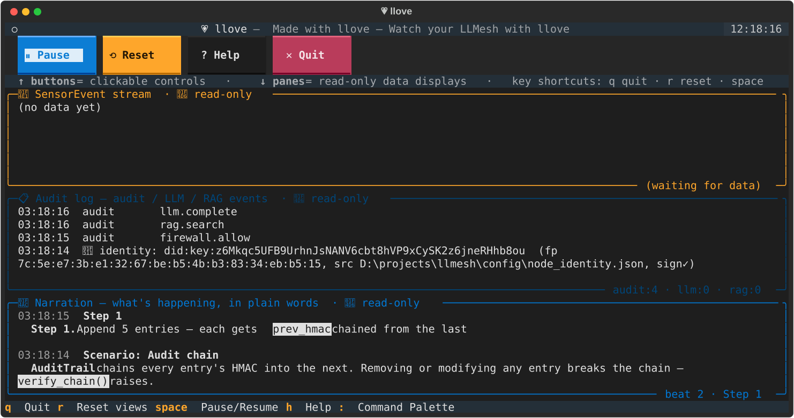

### Backends

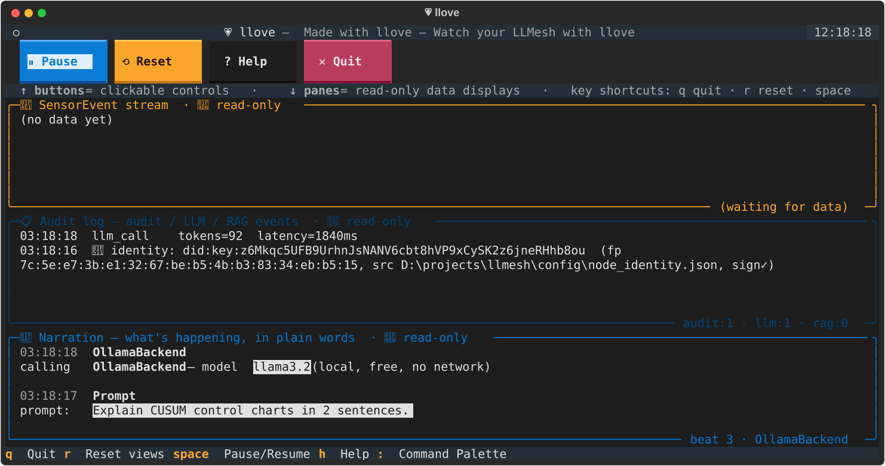

### Benchmark

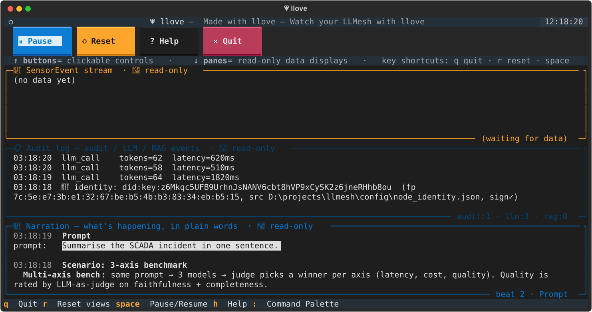

### Chat

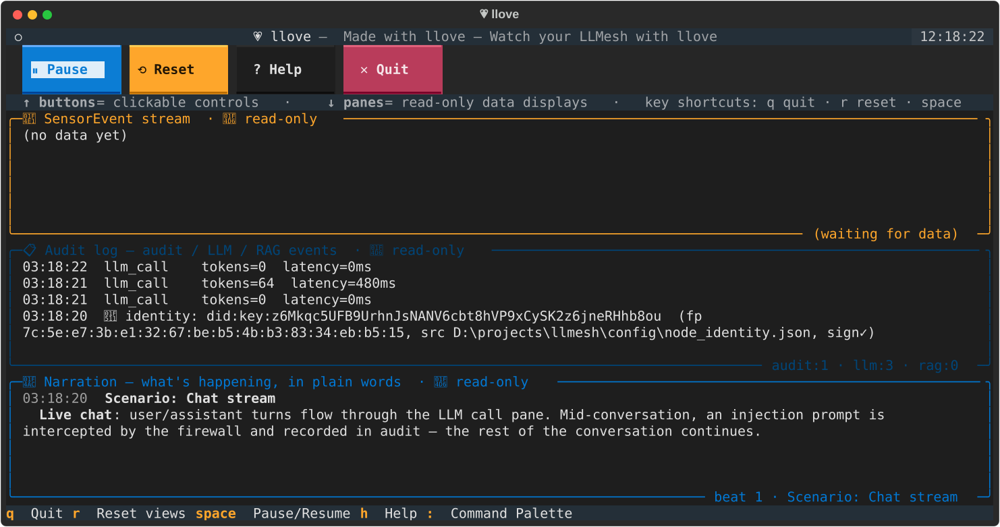

### Coin Toss

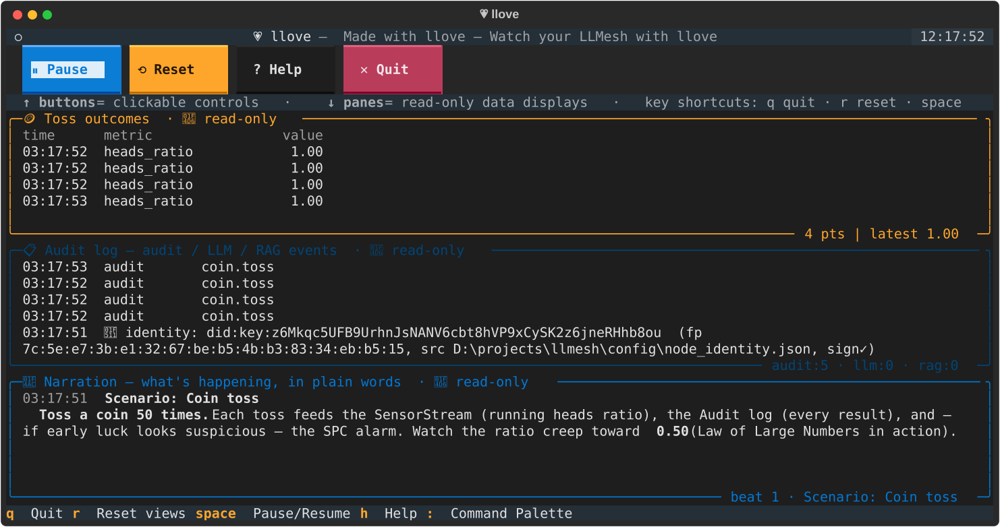

### Cost

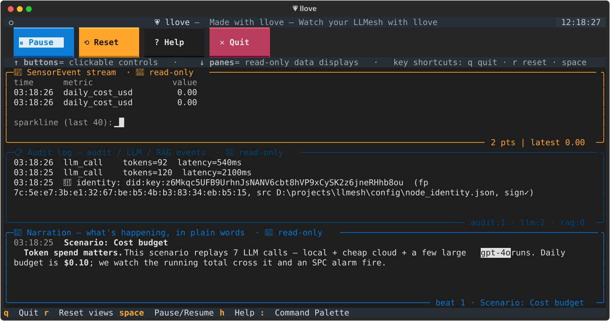

### Drift

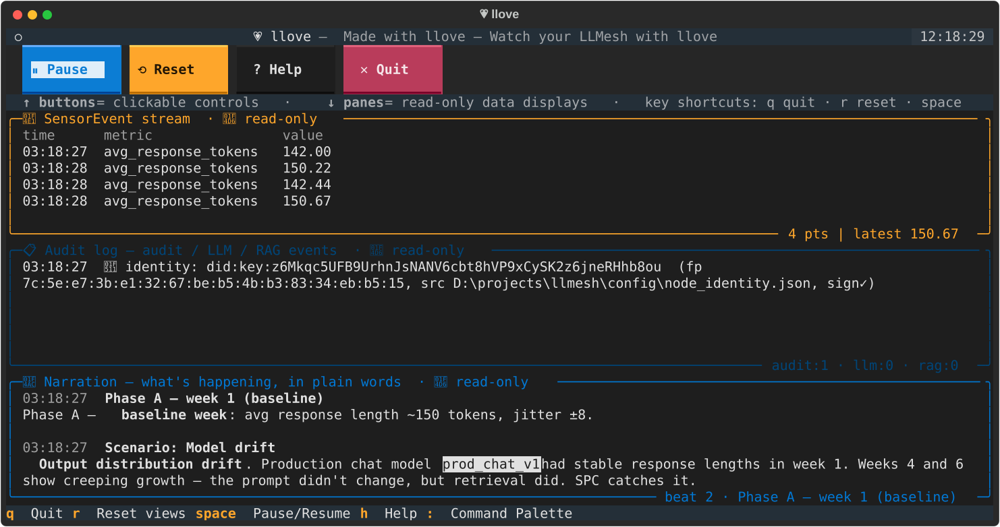

### Firewall

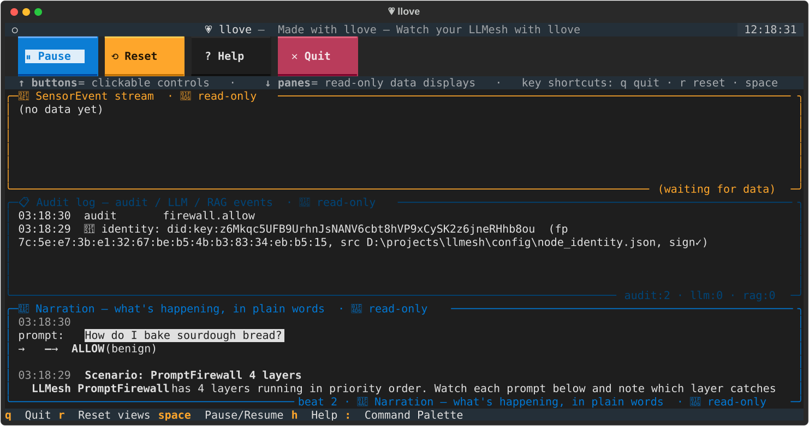

### MCP Call

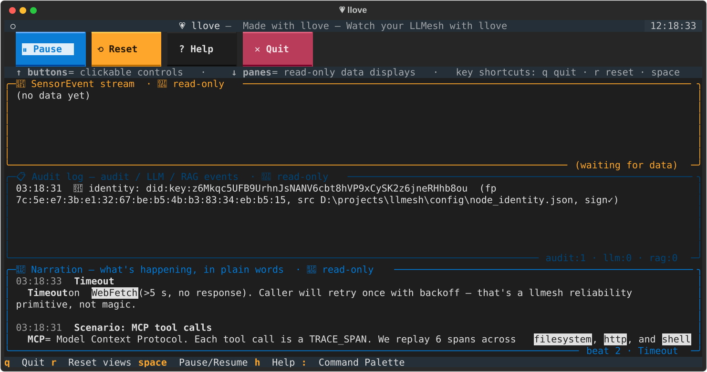

### Mindmap

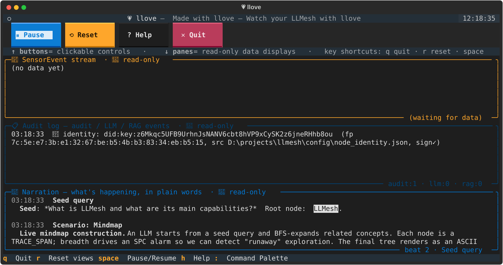

### Multimodal

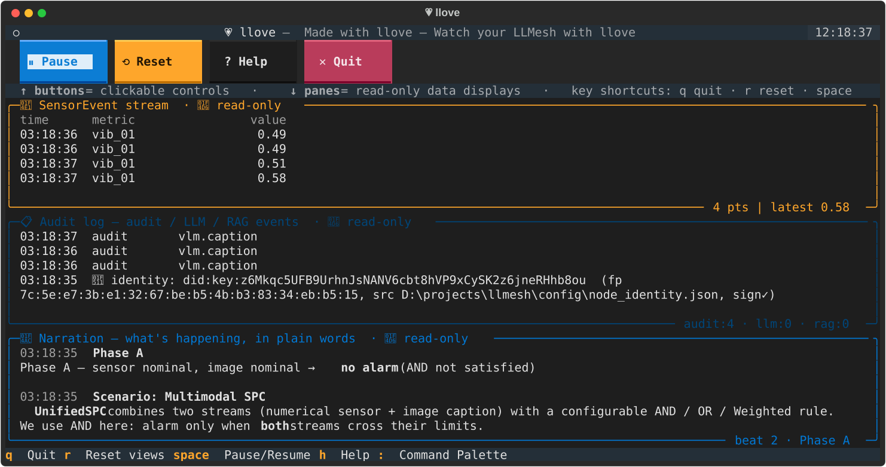

### Point Cloud

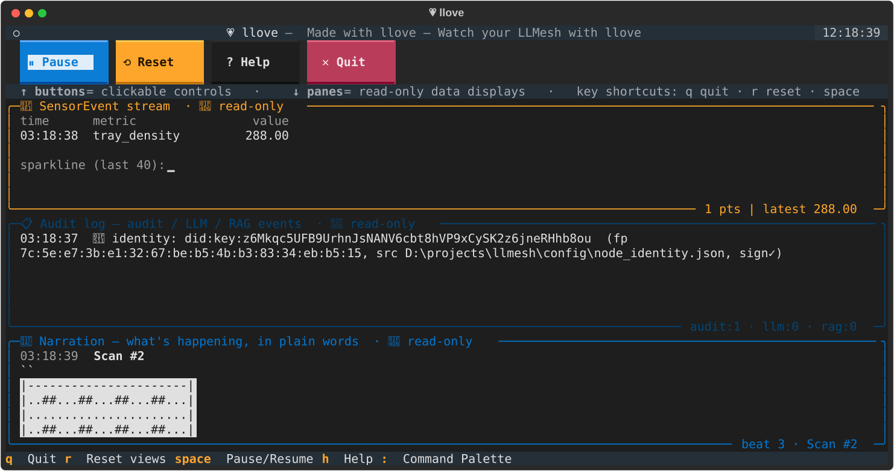

### RAG

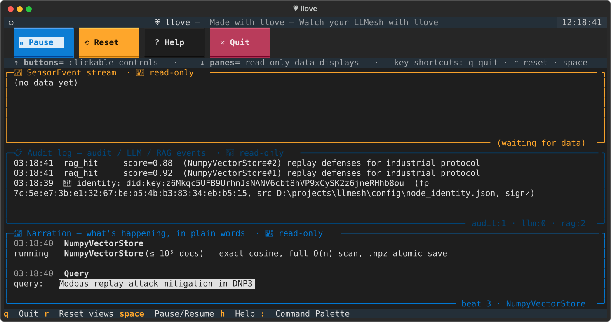

### Reliability

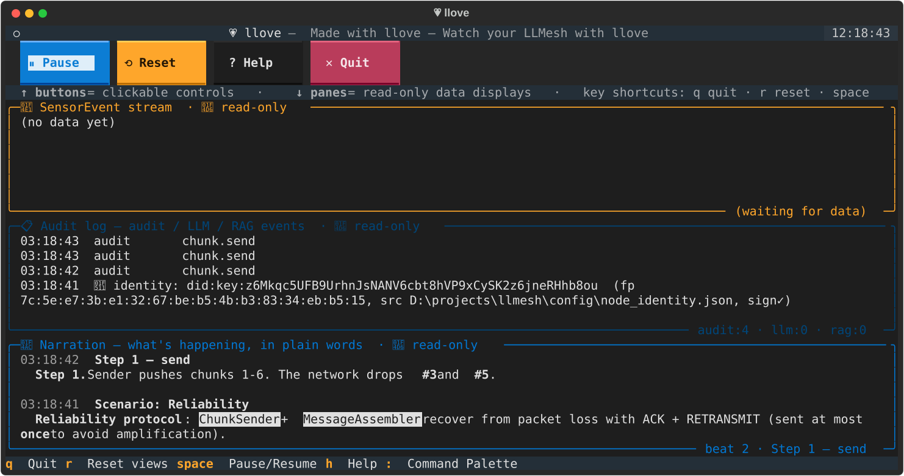

### SCADA

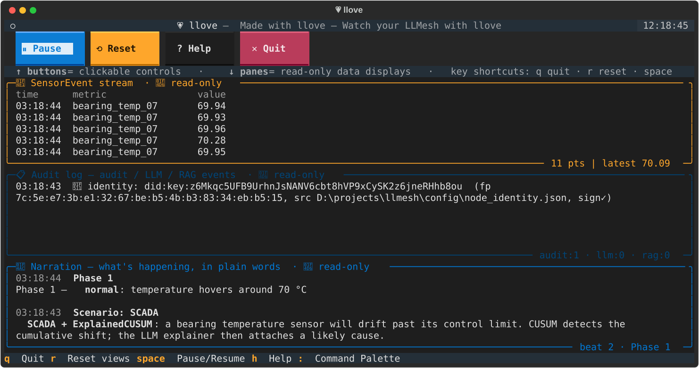

### Shogi

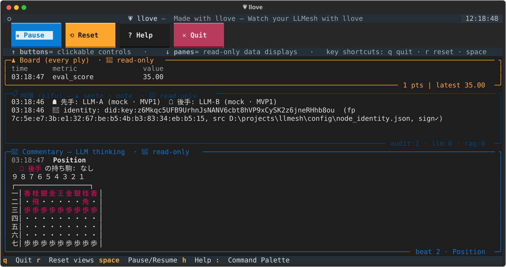

### Vision

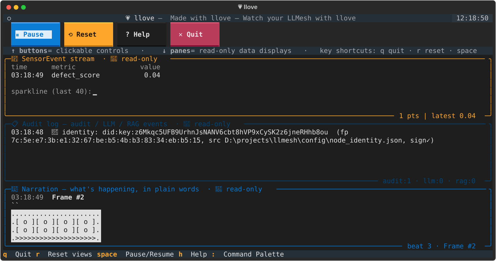

## 設計上のメモ

- `App.save_screenshot()` は Textual 標準機能、ターミナル非依存の SVG を生成
- LLM 呼び出しを必要とする scenario (chat / multimodal) は `MockBackend` 前提
- `--delay` は scenario が描画を開始するまでの時間。複雑な scenario は 3〜5 秒推奨
- SVG はテキストなので git diff で差分が見える (binary PNG と違って blame しやすい)

## 関連

- `scripts/export_demo_svgs.py` — SVG export スクリプト
- `llove/demo/scenarios/` — 全 scenario の実装
- `llove/app.py` — `LoveApp` (Textual ベース TUI)
